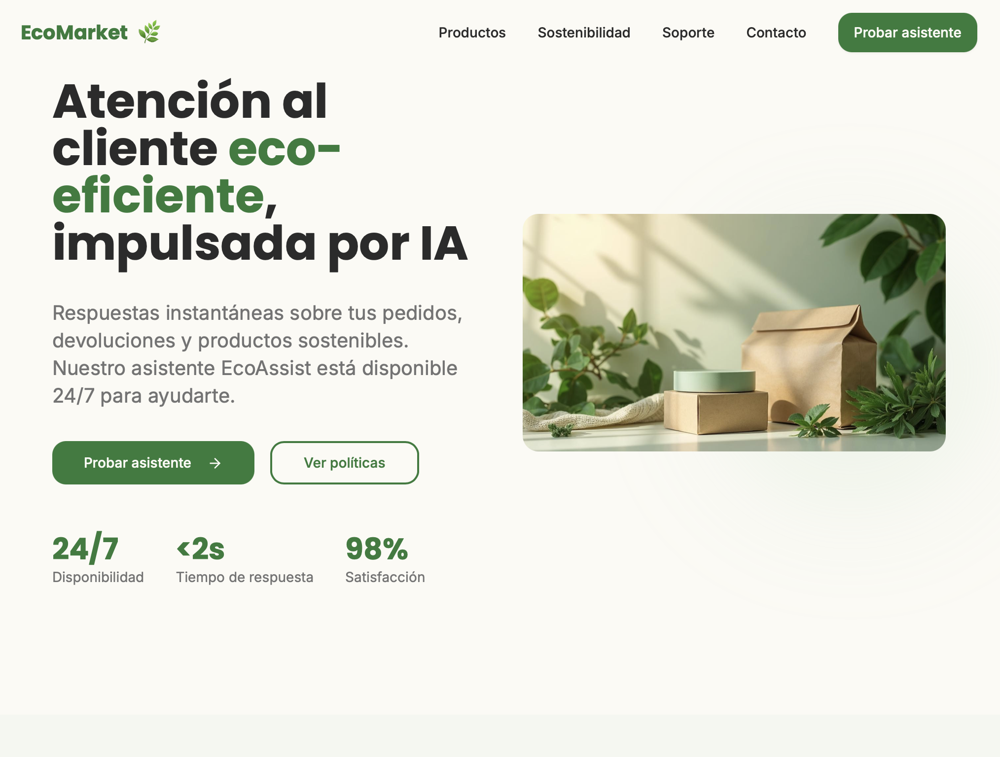

### 🌿 EcoMarket GenAI Agent – RAG + LangGraph + FastAPI



https://ecoassist-hub.lovable.app

Toda la parte teórica del proyecto se encuentra dentro del folder docs :) !! Gracias profe

Construye un agente de soporte “con criterio”: entiende intenciones, busca evidencia real (RAG con Pinecone), aplica reglas auditables (LangGraph + Tools) y responde con empatía. Incluye CLI, API web y UI opcional con Gradio.

---

### ✨ ¿Qué hace este proyecto?
- **Agente de Devoluciones**: Detecta intención, extrae `order_id` y `product_sku`, valida reglas de elegibilidad y genera etiqueta de retorno idempotente.
- **RAG de alta fidelidad**: Recupera fragmentos de políticas/FAQs/inventario desde Pinecone y cita fuentes con `last_updated`.
- **Arquitectura trazable**: Grafo de decisiones con LangGraph y herramientas tipadas (Pydantic) para que cada paso sea explicable.
- **Modos de uso**: CLI para probar rápido, API FastAPI para integraciones y UI embebida (Gradio) para demos.

---

### 🧭 Estructura del repositorio
- **`src/`**: Código principal
  - `agent/`
    - `graph.py`: Orquesta el flujo con LangGraph (intent → slots → RAG → reglas → respuesta). También expone `run_agent`.
    - `tools.py`: Tools tipadas: `rag_search`, `get_order_info` (mock), `check_eligibility`, `generate_return_label`.
    - `policy.py`: Utilidades de políticas: `has_policy_evidence`, `summarize_sources`.
    - `state.py`: Tipado del estado del agente.
  - `rag/`
    - `chain.py`: Pipeline RAG directo con Pinecone SDK v5 + OpenAI embeddings. Devuelve resultado y documentos fuente.
    - `prompts.py`: `SYSTEM_PROMPT` para tono/estilo y consistencia.
  - `processing/`
    - `cleaning.py`, `chunking.py`: Utilidades de limpieza y segmentación (apoyadas por `RecursiveCharacterTextSplitter`).
  - `loaders/`
    - `pdf_loader.py`, `csv_loader.py`, `json_loader.py`: Cargan políticas (PDF), inventario (CSV/XLSX) y FAQs (JSON) a un formato homogéneo.
  - `pinecone_io/`
    - `client.py`: Inicializa/asegura índice serverless y devuelve handler de datos.
    - `upsert.py`: Embedding y upsert por lotes con metadatos cuidadamente normalizados.
  - `server/`
    - `app.py`: FastAPI con endpoint `/v1/agent/chat`, health-check y UI opcional `/ui` (Gradio) si está instalado.
    - `schemas.py`: Esquemas Pydantic del API.
  - `app_cli.py`: CLI simple para consultar el RAG.
  - `app_web.py`: Placeholder para UI web (no requerido; usa FastAPI + Gradio).
  - `build_index.py`: Pipeline de indexación (carga → chunking → embeddings → upsert Pinecone).
- **`scripts/`**
  - `agent_cli.py`: CLI del agente end-to-end (flujo con LangGraph).
- **`docs/`**
  - `Ui Screenshot/image.png`: Portada del README.
  - `fase1/`: Análisis y diseño (selección de framework, herramientas y flujo).
  - `fase3/reflexion.md`: Reflexión y propuestas de mejora.
- **`gradio/EcoMarketRAGAgent/`**: Variante empaquetada con su propia `app.py`, requisitos y copia del código fuente para demos independientes.

---

### 🔧 Requisitos
- Python 3.10+
- Cuenta y API keys de OpenAI y Pinecone

Instala dependencias:

```bash
pip install -r requirements.txt
```

Variables de entorno (crear `.env` en la raíz):

```bash
OPENAI_API_KEY=sk-...
OPENAI_CHAT_MODEL=gpt-4o-mini
EMBEDDING_MODEL=text-embedding-3-small

PINECONE_API_KEY=...
PINECONE_INDEX=masteria22
PINECONE_CLOUD=aws
PINECONE_REGION=us-east-1

VECTOR_NAMESPACE=prod
DEBUG_MODE=false
```

---

### 📚 Construir el índice (RAG)
1) Prepara tus fuentes:
   - Políticas: `devoluciones.pdf`
   - Inventario: `inventario.csv` o `inventario.xlsx`
   - FAQs: `faqs.json` (formato: `[{"question":"...","answer":"..."}]`)
2) Ejecuta la indexación:

```bash
python -m src.build_index --policy ./data/devoluciones.pdf --inventory ./data/inventario.csv --faqs ./data/faqs.json
```

El script creará embeddings con OpenAI y hará upsert en Pinecone (namespace `VECTOR_NAMESPACE`).

---

### 🧪 Probar el RAG (CLI directa)

```bash
python -m src.app_cli
```

Escribe una pregunta y verás respuesta + fuentes.

---

### 🤖 Probar el Agente (CLI LangGraph)

```bash
python scripts/agent_cli.py
```

Ejemplos de prompts:
- "Quiero devolver ECO-SOAP-500, llegó dañado. Pedido EC-1001."
- "¿Puedo devolver un producto abierto de higiene?"

---

### 🌐 API Web (FastAPI) + UI opcional
Arranca el servidor:

```bash
uvicorn src.server.app:app --reload
```

Endpoints:
- `GET /health` → {"status":"ok"}
- `POST /v1/agent/chat` → cuerpo `{ "message": "...", "thread_id": "opcional" }`

Si tienes `gradio` instalado, visita `http://127.0.0.1:8000/ui` para una demo visual.

Ejemplo de petición:

```bash
curl -X POST http://127.0.0.1:8000/v1/agent/chat \
  -H 'Content-Type: application/json' \
  -d '{"message":"Quiero devolver ECO-SOAP-500, llegó dañado. Pedido EC-1001."}'
```

---

### 🧠 Cómo piensa el agente
1) **INTENT**: clasifica si es devolución o consulta genérica.
2) **SLOT_FILLING**: extrae `order_id`, `product_sku`, `condition` (detecta "defective" por palabras clave).
3) **POLICY_RETRIEVE**: usa `rag_search` para traer evidencia (doc_type="policy").
4) **ORDER_FETCH**: consulta la orden (mock) y verifica que el SKU pertenezca a la compra.
5) **ELIGIBILITY_CHECK**: reglas claras (ventana 30 días; higiene abierto excluido; defectuoso habilita excepción).
6) **LABEL_OR_DENY**: genera etiqueta idempotente o explica la negativa con alternativa.
7) **ANSWER_RETURN / GENERIC_RAG**: redacta respuesta breve, útil y con citas.

---

### 🛠️ Notas de implementación
- Pinecone v5: uso directo del SDK tanto para `query` como para `upsert` (metadatos incluyen el `text`).
- Embeddings: `text-embedding-3-small` (1536 dims) por defecto; ajusta `INDEX_DIM` si cambias.
- Config: centralizado en `src/config.py` y se imprime un resumen si `DEBUG_MODE=true`.
- Idempotencia: `generate_return_label` devuelve siempre la misma URL para el mismo `(order_id, product_sku)`.

---

### 🚀 Roadmap sugerido
- Reemplazos automáticos (no solo devoluciones), con logística e inventario real.
- Segmentación y fidelización: detectar insatisfacción y ofrecer gestos personalizados.
- CRM acoplado: consolidar datos de cliente y coordinar con el ecosistema EcoMarket.

---

### ⚡ Quickstart ultra-rápido
1) `pip install -r requirements.txt`
2) Crea `.env` con tus claves
3) `python -m src.build_index --policy ... --inventory ... --faqs ...`
4) CLI agente: `python scripts/agent_cli.py`
5) API: `uvicorn src.server.app:app --reload` y prueba `POST /v1/agent/chat`


