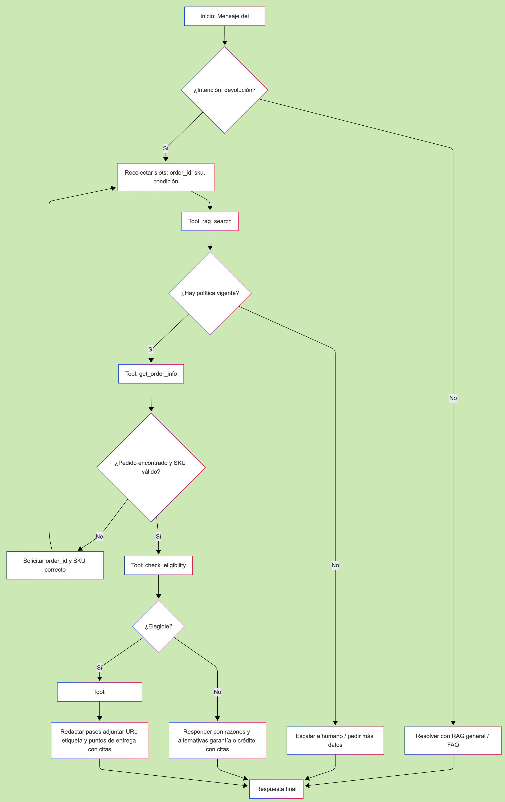

# 🧠 Flujo de trabajo del agente de devoluciones – EcoMarket

El diagrama de flujo gráfico que representa este proceso se encuentra en la carpeta docs/DiagramaMermaidFlujo.png.

El flujo de trabajo del agente de devoluciones de EcoMarket sigue una arquitectura basada en estados, diseñada para que el agente pueda tomar decisiones autónomas y coherentes en cada punto crítico del proceso. Cada transición del flujo corresponde a una acción o evaluación lógica que el agente realiza, apoyándose en las herramientas definidas (RAG, consulta de pedidos, verificación de elegibilidad y generación de etiquetas).

## 🗺️ Estados y transiciones

A continuación, se describen los estados y transiciones principales del flujo, junto con los criterios de decisión y la intención detrás de cada uno.

⸻

### 1) START → INTENT

En este primer paso, el agente recibe el mensaje del cliente y determina si la intención corresponde a un proceso de devolución.
Si identifica que la consulta es sobre otro tema (por ejemplo, disponibilidad de productos o preguntas frecuentes), el agente redirige la interacción hacia el sistema RAG general, recupera la información pertinente y responde cerrando el flujo.
Cuando sí detecta una intención de devolución, el flujo continúa hacia la fase de recolección de datos (slot filling).

⸻

### 2) INTENT → SLOT_FILLING

Aquí el agente se enfoca en recopilar los datos esenciales para procesar la solicitud: el número de orden (order_id), el identificador del producto (product_sku) y el estado del producto (product_condition), que puede ser sealed, opened o defective.
Si alguno de estos datos no está disponible, el agente pregunta al cliente de forma contextual y empática antes de continuar.
Esta etapa garantiza que el sistema disponga de la información mínima necesaria para ejecutar los pasos posteriores sin errores.

⸻

### 3) SLOT_FILLING → POLICY_RETRIEVE

Una vez que los datos iniciales están completos, el agente ejecuta la herramienta rag_search con un filtro específico de tipo de documento (doc_type_filter="policy"), buscando fragmentos relevantes de las políticas de devolución.
Esta etapa tiene como objetivo encontrar evidencia textual actualizada que respalde cualquier decisión posterior.
Si no se encuentra información suficiente en la base de conocimiento, el agente puede pedir más contexto al cliente o escalar la solicitud a un agente humano, evitando emitir respuestas sin fundamento documental.

⸻

### 4) POLICY_RETRIEVE → ORDER_FETCH

Con las políticas identificadas, el agente consulta los detalles del pedido utilizando la herramienta get_order_info(order_id).
Aquí valida que el pedido exista, que el SKU del producto coincida con uno realmente comprado y que la categoría esté correctamente registrada (por ejemplo, “higiene”, “perecedero” o “electrónico”).
Si hay inconsistencias o el pedido no se encuentra, el agente solicita corrección y regresa al estado de SLOT_FILLING, reforzando así la integridad transaccional del proceso.

⸻

### 5) ORDER_FETCH → ELIGIBILITY_CHECK

En esta transición, el agente evalúa la elegibilidad de la devolución usando la función check_eligibility(purchase_date, category, condition, policy_snippets).
El resultado devuelve un objeto estructurado con la información {eligible: bool, reason, days_elapsed, window_days}.
De esta manera, el agente puede determinar si el producto cumple las condiciones de devolución (por ejemplo, dentro del período de 30 días o con defecto de fábrica).
Esta fase integra evidencia documental con datos del pedido, asegurando decisiones auditables.

⸻

### 6) ELIGIBILITY_CHECK → (LABEL | DENY)

Si el resultado indica que la devolución es elegible, el flujo continúa hacia el estado LABEL, donde se genera la etiqueta correspondiente mediante la herramienta generate_return_label(order_id, product_sku).
El agente prepara un mensaje con los pasos, el enlace de descarga y las instrucciones logísticas.

En cambio, si la devolución no es elegible, el agente pasa al estado DENY, donde explica claramente las razones (como vencimiento del plazo o categoría no retornable) y ofrece alternativas viables, como activar una garantía o entregar un crédito de cliente.
En ambos casos, la respuesta final cita fragmentos de las políticas obtenidas con RAG para dar transparencia y trazabilidad.

⸻

### 7) (LABEL | DENY) → ANSWER

Finalmente, el agente redacta la respuesta definitiva al cliente.
Esta respuesta mantiene un tono empático, profesional y estructurado, incorporando citas relevantes (fuente y fecha) de las políticas que respaldan la decisión.
En este punto, el flujo se considera completo, y la conversación puede cerrarse o continuar con una interacción de seguimiento.

⸻

## ⚙️ Puntos clave del flujo (decisiones del agente)

El agente se rige por seis principios operativos:
	1.	Detección de intención y slots: si faltan datos críticos, el agente pregunta antes de continuar; si no se indica la condición del producto, asume "sealed" y confirma con el usuario.
	2.	Evidencia primero (RAG): todas las decisiones se basan en documentos reales; si no hay evidencia, el agente evita inferencias y sugiere escalar.
	3.	Verificación transaccional: la herramienta get_order_info es la fuente de verdad del pedido, y evita fraudes o errores de SKU.
	4.	Reglas auditables: la elegibilidad se evalúa según plazos y exclusiones claras (productos abiertos, perecederos, personalizados o plantas después de 48 h). Las excepciones por defecto de fábrica siempre se consideran.
	5.	Acción idempotente: si ya se generó una etiqueta para un pedido y SKU, generate_return_label devuelve la misma.
	6.	Respuestas con citas: el mensaje final siempre referencia las fuentes documentales para respaldar su decisión.

⸻

## 🔁 Manejo de errores y reintentos

El agente cuenta con mecanismos de control ante errores comunes.
Si la consulta al vector store (Pinecone) falla, realiza un reintento; si persiste el error, lo comunica al cliente y ofrece escalar.
Si el pedido no se encuentra, solicita nuevamente el order_id; tras dos intentos fallidos, escala el caso.
Si el SKU no es válido, sugiere ítems del pedido registrado.
Por último, si no se dispone de políticas en la base, el agente evita decidir y pide confirmación o intervención humana.

⸻

## 🌿 Ejemplo de recorrido “feliz”
	1.	El cliente envía: “¿Puedo devolver mi ECO-SOAP-500? Llegó dañado. EC-1001.”
	2.	El agente realiza rag_search(policy) y encuentra la política de 30 días con garantía de 1 año.
	3.	Luego ejecuta get_order_info(EC-1001) y obtiene que la compra fue hace 12 días, en la categoría “higiene”.
	4.	Llama a check_eligibility(..., condition="defective") → resultado: elegible.
	5.	Genera una etiqueta con generate_return_label(EC-1001, ECO-SOAP-500) y obtiene el enlace de envío.
	6.	Finalmente, responde con pasos claros, tiempos de devolución y citas de las políticas.

Este recorrido refleja el funcionamiento ideal del agente, demostrando cómo combina razonamiento autónomo, integración con datos reales y evidencia documental para ofrecer una experiencia confiable, humana y alineada con los valores sostenibles de EcoMarket.